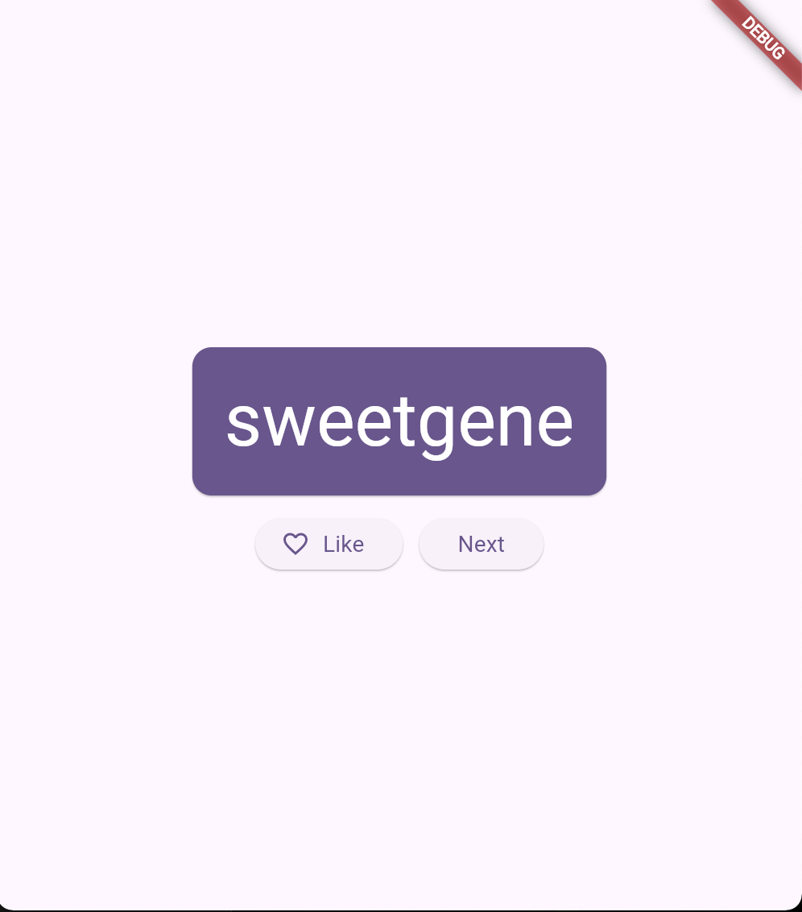
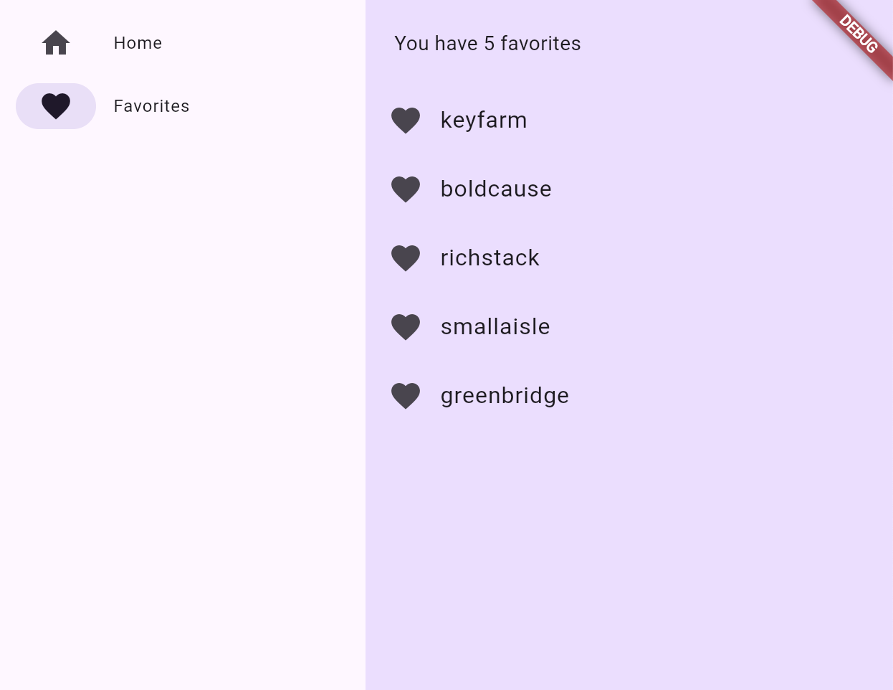

# The First Flutter application

A new Flutter project.
<!--  -->

<\t>

## Getting Started

This project is a starting point for a Flutter application.

## What we've covered
- The basics of how Flutter works
- Creating layouts in Flutter
- Connecting user interactions (like button presses) to app behavior
- Keeping your Flutter code organized
- Making your app responsive
- Work with ListView
- Achieving a consistent look & feel of your app
